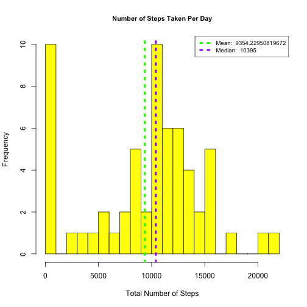
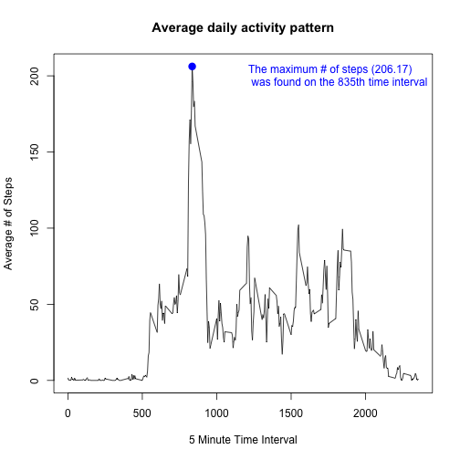
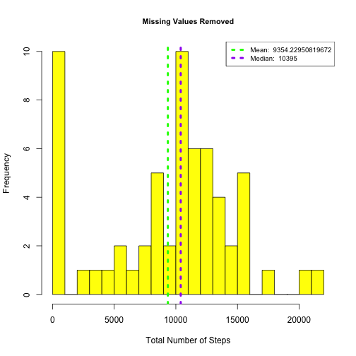
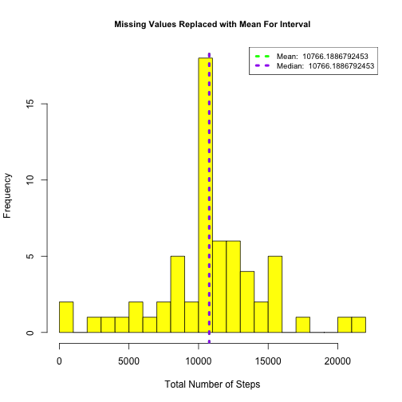
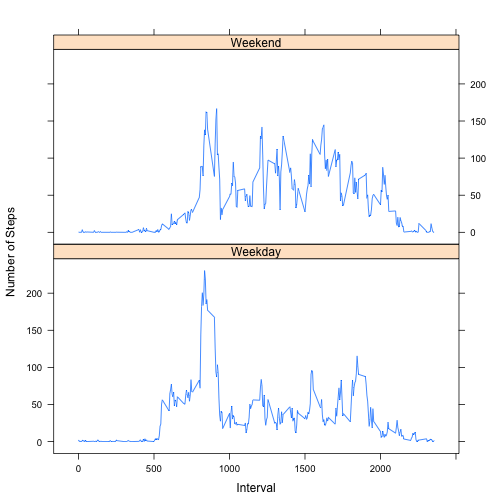

**The following document describes the analysis for the Coursera Reproducable Research class' Peer Assessment 1.**

##Analysis Prep: Loading & preprocessing Data

---

Section 0: Clear the environment by removing any exisitng environment variables

```r
#Remove any exisiting environment variables
rm(list = ls(all = TRUE)) 

#Ensure that any needed packages are loaded
library(data.table)
library(lubridate)
library(dplyr)
library(lattice)
```

Section 1: Open and process the dataset.  The following paragraph describes the dataset: 

*This assignment makes use of data from a personal activity monitoring device. This device collects data at 5 minute intervals through out the day. The data consists of two months of data from an anonymous individual collected during the months of October and November, 2012 and include the number of steps taken in 5 minute intervals each day.*


The variables included in this dataset are:

1. **steps**: Number of steps taking in a 5-minute interval (missing values are coded as NA ) 
2. **date**: The date on which the measurement was taken in YYYY-MM-DD format 
3. **interval**: Identifier for the 5-minute interval in which measurement was taken

Step 1.1: Load the data using the read.csv() method.

```r
activityData <- read.csv('activity.csv', header = T)
```

Step 1.2: Process/transform the data (if necessary) into a format suitable for your analysis

```r
activityData$date <- ymd(activityData$date)
activityDT <- data.table(activityData)
```

Step 1.3: Take a quick peek at the dataset

```r
head(activityData)
```

```
##   steps       date interval
## 1    NA 2012-10-01        0
## 2    NA 2012-10-01        5
## 3    NA 2012-10-01       10
## 4    NA 2012-10-01       15
## 5    NA 2012-10-01       20
## 6    NA 2012-10-01       25
```


---

##Analysis Question: What is mean total number of steps taken per day?

---

Section 2: Create a histogram displaying the total number of steps taken each day and calculate the mean and median:

Step 2.0: Summarize the data by day grouping

```r
activityDailyGrouping <- group_by(activityData, date)
activitySummary <- summarise(activityDailyGrouping,
                              total = sum(steps, na.rm = TRUE),
                              average = mean(steps, na.rm = TRUE),
                              median = median(steps, na.rm = TRUE))

#Take a peek at the data
activitySummary
```

```
## Source: local data frame [61 x 4]
## 
##          date total  average median
##        (time) (int)    (dbl)  (dbl)
## 1  2012-10-01     0      NaN     NA
## 2  2012-10-02   126  0.43750      0
## 3  2012-10-03 11352 39.41667      0
## 4  2012-10-04 12116 42.06944      0
## 5  2012-10-05 13294 46.15972      0
## 6  2012-10-06 15420 53.54167      0
## 7  2012-10-07 11015 38.24653      0
## 8  2012-10-08     0      NaN     NA
## 9  2012-10-09 12811 44.48264      0
## 10 2012-10-10  9900 34.37500      0
## ..        ...   ...      ...    ...
```

```r
#Calculate the mean and median values and save for later
meanVal <- mean(activitySummary$total, na.rm=TRUE)
medianVal <- median(activitySummary$total, na.rm=TRUE)
```

Step 2.1: Create a reusable histogram function for the total number of Steps per day with the mean & median listed in legend.

**Please see the legend for the reported Mean and Median values**


```r
stepsHist <- function(vec, title, avg, med){
  hist(vec, 
    breaks = 20,
    main = title,
    xlab = 'Total Number of Steps', 
    col = 'yellow',
    cex.main = .9)
        
    #Add ablines for mean and median on histogram
    abline(v=avg, lty = 3, lwd = 4, col = 'green')
    abline(v=med, lty = 3, lwd = 4, col = 'purple')
        
    #Add a legend for the mean and median values
    legend('topright', 
      lty = 3, 
      lwd = 4, 
      col = c("green", "purple"),
      cex = .8, 
      legend = c(paste('Mean: ', avg), paste('Median: ', med)))
}

#Generate the histogram using the reusable function
stepsHist(activitySummary$total, 'Number of Steps Taken Per Day', meanVal, medianVal)
```

 

Step 2.2: Report the Mean and Median values

```
## Mean number of steps: 9354.23
```

```
## Median number of steps: 10395
```


---

##Analysis Question: What is the average daily activity pattern?

---


**From the assignment, the plot below will address the following requirements:**

1.  Make a time series plot (i.e. type = "l") of the 5-minute interval (x-axis) and the average number of steps taken, averaged across all days (y-axis)
2.  Which 5-minute interval, on average across all the days in the dataset, contains the maximum number of steps?

Step 3.0: Summarize the dataset by interval & find the maximum steps value

```r
##Summarize the dataset by interval
activityIntervalSummary <- activityDT[, list(avgSteps = mean(steps, na.rm = T)), by = interval]

## Find the interval that has the maximum average steps
maximumSteps <- activityIntervalSummary[which.max(avgSteps), ]
```

Step 3.1: Plot the interval graph

```r
##Plot the interval graph
with(activityIntervalSummary, {
  plot(interval, 
    avgSteps, 
    type = 'l',
    main = "Average daily activity pattern",
    xlab = "5 Minute Time Interval",
    ylab = "Average # of Steps")
  })

#Create the string for the legend
maxLabel <- paste('The maximum # of steps (', round(maximumSteps$avgSteps, 2), ')\n was found on the ', maximumSteps$interval, 'th time interval', sep = '')

#Find the location of the max steps for placing a big point on the plot
points(maximumSteps$interval, maximumSteps$avgSteps, col = 'blue', lwd = 4, pch = 19)

#Finally, add the legend to the plot
legend("topright", legend = maxLabel, text.col = 'blue', bty = 'n')
```

 

Step 3.2: Report the interval which holds the max average steps

```
## The maximum # of steps (206.17) was found on the 835th time interval
```


---

##Analysis Question: Imputing missing values

---

**From the assignment, the following requirements will be addressed:**

Note that there are a number of days/intervals where there are missing values (coded as NA). The presence of missing days may introduce bias into some calculations or summaries of the data.

1. Calculate and report the total number of missing values in the dataset (i.e. the total number of rows with NAs)

2. Devise a strategy for filling in all of the missing values in the dataset. The strategy does not need to be sophisticated. For example, you could use the mean/median for that day, or the mean for that 5-minute interval, etc.

3. Create a new dataset that is equal to the original dataset but with the missing data filled in.

4. Make a histogram of the total number of steps taken each day and Calculate and report the mean and median total number of steps taken per day. 


Section 4: Create a histogram with imputed values that displays the total number of steps taken each day 
            and calculate the mean and median:


Step 4.1: Find and report the total number of rows with NAs

```r
cat('The number of NAs:', sum(is.na(activityData$steps)))
```

```
## The number of NAs: 2304
```

Step 4.2: Devise a strategy to impute the missing values

```r
replaceIfNA <- function(a,b){
  if(is.na(a)){
    return(b)
  }
  return(a)
}
```

Step 4.3: Create a new dataset with missing data filled in

```r
#Align the original dataset with the Activity Interval Summary dataset created earlier
setkey(activityDT, interval)
setkey(activityIntervalSummary, interval)

#Create the new dataset with missing data filled in using the average
activityWithMissingValuesDT <- activityDT[activityIntervalSummary]
activityWithMissingValuesDT$newSteps <- mapply(replaceIfNA, 
                                               activityWithMissingValuesDT$steps, 
                                               activityWithMissingValuesDT$avgSteps)

#Take a peak at the new dataset
head(activityWithMissingValuesDT)
```

```
##    steps       date interval avgSteps  newSteps
## 1:    NA 2012-10-01        0 1.716981  1.716981
## 2:     0 2012-10-02        0 1.716981  0.000000
## 3:     0 2012-10-03        0 1.716981  0.000000
## 4:    47 2012-10-04        0 1.716981 47.000000
## 5:     0 2012-10-05        0 1.716981  0.000000
## 6:     0 2012-10-06        0 1.716981  0.000000
```

Step 4.4: Generate the histogram using the imputed values and calculate the mean and median

```r
#Summarize new dataset by day
actMissingSummary <- activityWithMissingValuesDT[, list(newSteps = sum(newSteps, na.rm = T)), by = date]

#Regenerate the original histogram for side-by-side comparison
stepsHist(activitySummary$total, 'Missing Values Removed', meanVal, medianVal)
```

 

```r
#Calculate the new Mean and Median values using the imputed values
meanVal <- mean(actMissingSummary$newSteps, na.rm=TRUE)
medianVal <- median(actMissingSummary$newSteps, na.rm=TRUE)

#Generate the new histogram with the imputed data
stepsHist(actMissingSummary$newSteps, 'Missing Values Replaced with Mean For Interval', meanVal, medianVal)
```

 

Step 4.5: Report the Mean and Median values

```
## Mean number of steps: 10766.19
```

```
## Median number of steps: 10766.19
```

Reviewing this imputed data, the following concerns have been asked and answered:

1. Do these values differ from the estimates from the first part of the assignment? Yes, as can be expected the replacement of missing (NA) values adds many more samples which impact the mean and median calculations.

2. What is the impact of imputing missing data on the estimates of the total daily number of steps? The first conclusion is that the median increases slightly.  The second conclusion is that the mean is increased substantially and suprisingly becomes equal to the median!


---

##Analysis Question: Are there differences in activity patterns between weekdays and weekends?

---

**From the assignment, the following requirements will be addressed:**

1. Create a new factor variable in the dataset with two levels -- "weekday" and "weekend" indicating whether a given date is a weekday or weekend day.

2. Make a panel plot containing a time series plot (i.e. type = "l") of the 5-minute interval (x-axis) and the average number of steps taken, averaged across all weekday days or weekend days (y-axis). 

Section 5: Explore differences between weekday and weekend data

Step 5.0: Create function to partition weekend from weekday data

```r
isWeekend <- function(d){
  if(d %in% c('Saturday', 'Sunday')){
    return('Weekend')
  }
  return('Weekday')
}
```

Step 5.1: Add a new factor variable indicating whether the day is a weekend or not

```r
#Add the name of the day to dataset
activityWithMissingValuesDT$dayname <- weekdays(as.Date(activityWithMissingValuesDT$date))

#Add the daytype to indicate whether weekend or not
activityWithMissingValuesDT$daytype <- as.factor(apply(as.matrix(activityWithMissingValuesDT$dayname), 1, isWeekend))

#Summarize the dataset with the mean grouped by interval and daytype
actMissingSummary <- activityWithMissingValuesDT[, list(avgSteps = mean(newSteps, na.rm = T)), by = list(interval, daytype)]

#Take a peek at the dataset
str(actMissingSummary)
```

```
## Classes 'data.table' and 'data.frame':	576 obs. of  3 variables:
##  $ interval: int  0 0 5 5 10 10 15 15 20 20 ...
##  $ daytype : Factor w/ 2 levels "Weekday","Weekend": 1 2 1 2 1 2 1 2 1 2 ...
##  $ avgSteps: num  2.2512 0.2146 0.4453 0.0425 0.1732 ...
##  - attr(*, ".internal.selfref")=<externalptr>
```

Step 5.2: Lastly, generate the plot

```r
xyplot(avgSteps~interval | daytype, data = actMissingSummary,
      type = 'l',
      xlab = 'Interval',
      ylab = 'Number of Steps',
      layout = c(1,2))
```

 
